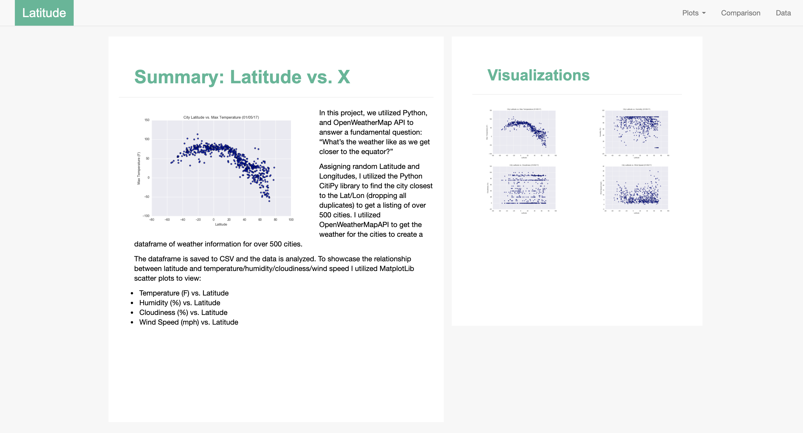
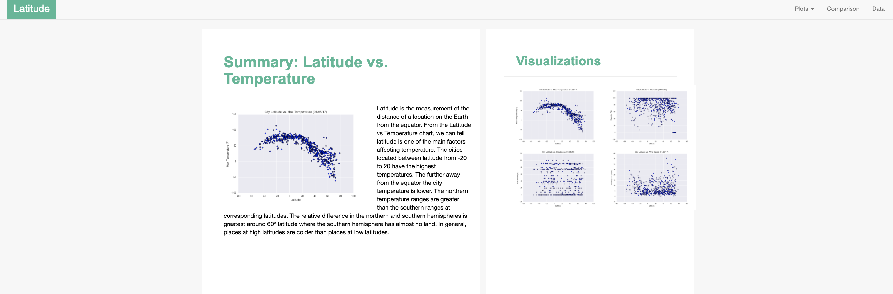
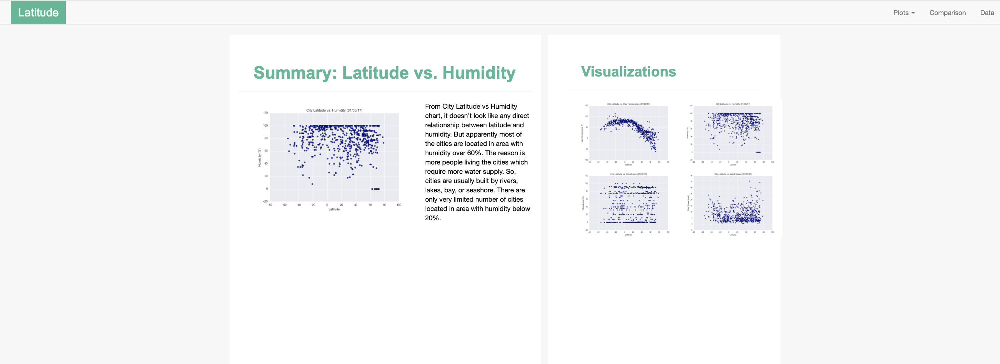
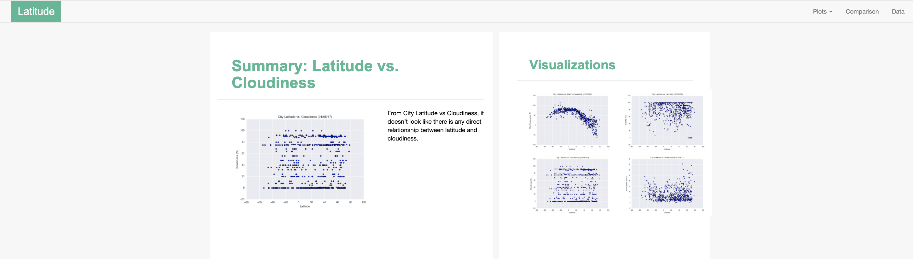
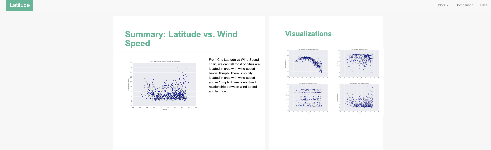

# Web Design
## Background
Data is more powerful when we share it with others! Let's take what we've learned about HTML and CSS to create a dashboard showing off the analysis we've done.

## Latitude - Latitude Analysis Dashboard with Attitude

In building this dashboard, I created individual pages for each plot and a means by which one can navigate between them. These pages will contain the visualizations and their corresponding explanations. There is also a landing page, a page where one can see a comparison of all of the plots, and another page where one can view the data used to build them.

Website Requirements
For reference, see the "Screenshots" section below.

## The website consists of 7 pages in total, including:

* A [landing page](#landing-page) containing:
  * An explanation of the project.
  * Links to each visualizations page. There should be a sidebar containing preview images of each plot, and clicking an image should take the user to that visualization.
  
Here's a screen shot of how landing page looks like:
 
 
* Four [visualization pages](#visualization-pages), each with:
  * A descriptive title and heading tag.
  * The plot/visualization itself for the selected comparison.
  * A paragraph describing the plot and its significance.
Here's a screen shot of how summary pages look like for each of the 4 graphs:

* A ["Comparisons" page](#comparisons-page) that:
  * Contains all of the visualizations on the same page so we can easily visually compare them.
  * Uses a Bootstrap grid for the visualizations.
    * The grid must be two visualizations across on screens medium and larger, and 1 across on extra-small and small screens.
* A ["Data" page](#data-page) that:
  * Displays a responsive table containing the data used in the visualizations.
    * The table must be a bootstrap table component. [Hint](https://getbootstrap.com/docs/4.3/content/tables/#responsive-tables)
    * The data must come from exporting the `.csv` file as HTML, or converting it to HTML. Try using a tool you already know, pandas. Pandas has a nifty method approprately called `to_html` that allows you to generate a HTML table from a pandas dataframe. See the documentation [here](https://pandas.pydata.org/pandas-docs/version/0.17.0/generated/pandas.DataFrame.to_html.html)

The website must, at the top of every page, have a navigation menu that:

* Has the name of the site on the left of the nav which allows users to return to the landing page from any page.
* Contains a dropdown menu on the right of the navbar named "Plots" that provides a link to each individual visualization page.
* Provides two more text links on the right: "Comparisons," which links to the comparisons page, and "Data," which links to the data page.
* Is responsive (using media queries). The nav must have similar behavior as the screenshots ["Navigation Menu" section](#navigation-menu) (notice the background color change).
 

## Considerations
You may use the weather data or choose another dataset. Alternatively, you may use the included cities dataset and pull the images from the assets folder.
You must use Bootstrap. This includes using the Bootstrap navbar component for the header on every page, the bootstrap table component for the data page, and the Bootstrap grid for responsiveness on the comparison page.
You must deploy your website to GitHub pages, with the website working on a live, publicly accessible URL as a result.
Be sure to use a CSS media query for the navigation menu.
Be sure your website works at all window widths/sizes.
Feel free to take some liberty in the visual aspects, but keep the core functionality the same.